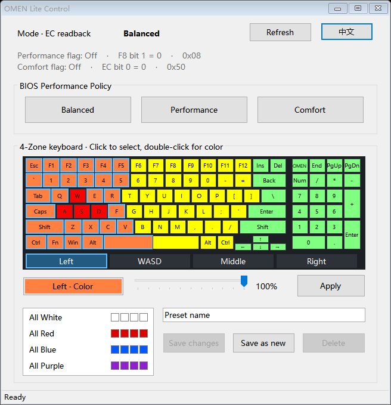

# OMEN-Lite-Control

[English](README.md) | [简体中文](README.zh-CN.md)

Performance and keyboard lighting controls for **HP OMEN 15 (2018), i7-8750H + GTX 1060, SSID 84DB / BIOS F.19**. Only tested on this configuration.

## Features

- Balanced, Performance and Comfort BIOS modes, with EC state readback
- Clickable four-zone keyboard with color and brightness controls
- Lighting presets with edit, rename, save-as and delete
- Chinese and English interface

## Usage

1. Download the ZIP from [Releases](https://github.com/JJl624/OMEN-Lite-Control/releases), extract all files, and run `OMEN-Lite-Control.exe` as administrator.
2. Click **Enable readback (install driver)** if prompted. The PawnIO installer is included; an existing compatible driver is reused. Mode switching and keyboard lighting work without it.
3. Select a performance mode. For lighting, click a keyboard zone, double-click to choose a color, adjust brightness, then click **Apply**. Loading a preset does not apply it automatically.

Keep the `driver` folder beside the executable. Settings are saved in `data`. Click **Refresh** after changing modes elsewhere; hardware operations have a 1-second cooldown.

[Release notes](CHANGELOG.md) · [MIT license](LICENSE) · [Third-party notices](THIRD_PARTY_NOTICES.md)

Built with Codex.
