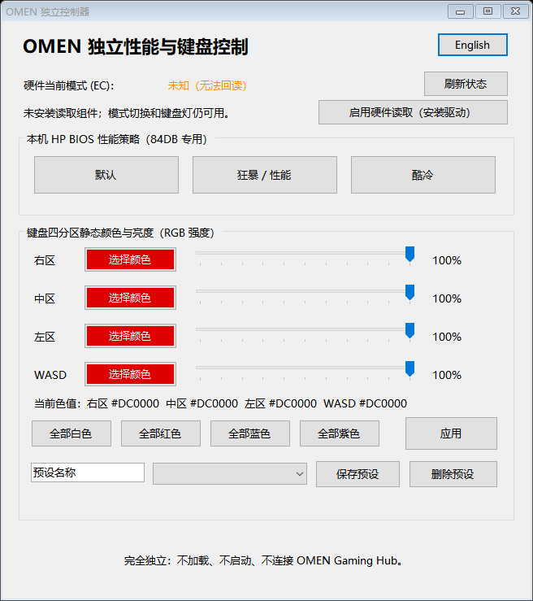

# OMEN Lite Control

轻量的 HP OMEN 性能模式与四分区键盘灯控制工具。无需启动 OMEN Gaming Hub，支持中英文界面。

**当前版本：v0.3.0 · Windows x64**

当前性能模式切换和 EC 回读仅支持已验证的 **HP OMEN 15-dc0xxx / 主板 84DB / BIOS F.19**。其他主板或 BIOS 会拒绝这两项操作，不能直接套用本机寄存器映射。键盘功能也只在本机四分区 RGB 键盘上验证。

[下载 v0.3.0 便携包](https://github.com/JJl624/OMEN-Lite-Control/releases/download/v0.3.0/OMEN-Lite-Control-v0.3.0-portable.zip) · [更新内容](docs/releases/v0.3.0.md) · [English](#english)

## 界面

中文界面，显示真实 EC 性能状态与键盘颜色：


<details>
<summary>English UI</summary>


</details>

## 功能

- 三种原生 BIOS 模式：**默认、狂暴 / 性能、酷冷**。
- 当前模式读取 BIOS 控制的真实 EC 标志，不再把“最后设置的模式”当成当前状态。
- 四分区静态 RGB、各区亮度与最多 8 个本地预设。
- 刷新、切换和应用防连点；硬件请求串行执行，完成后至少间隔 1 秒。
- 语言切换、颜色和预设编辑随时可用，不会因为硬件操作而锁住。
- 不持续后台轮询，不显示屏幕刷新率和读取时间。

Eco 已移除：旧 Eco 是默认 BIOS 模式叠加软件限帧、降低刷新率和禁用 CPU 睿频，并非第四种原生 BIOS 模式。普通模式切换不再修改这些软件设置。

## 安装与首次启动

1. 下载上方的 **portable.zip**，不要选择 GitHub 自动生成的 Source code 压缩包。
2. 将压缩包**完整解压到可写目录**，例如 `D:\Apps\OMEN-Lite-Control`。不要在压缩包内直接运行，也不要只取出 EXE。
3. 运行 `OMEN-Lite-Control.exe`，接受 Windows 管理员权限提示。`OmenModeSwitcher.exe` 是相同程序的兼容文件名，任选一个即可。
4. 若已有可用的 PawnIO 2.2.0 或更新驱动，程序直接复用。若显示下方按钮，点击 **启用硬件读取（安装驱动）**，使用随包的官方签名 PawnIO 2.2.0 安装包完成一次安装，无需另行下载。
5. 如果程序提示需要重启，请手动重启 Windows 后再次打开。程序不会自动重启电脑。

缺失驱动时的界面示意（由当前程序模拟该检测结果生成）：



**主程序无需安装，EC 回读需要一次性安装内核驱动。** 启动、刷新和退出均不会自动安装或卸载驱动。没有 PawnIO 时，受支持机器上的 BIOS 模式切换和键盘控制仍可用，但无法确认实际性能状态。

| 组件 | 用途与要求 |
| --- | --- |
| Windows x64、.NET Framework 4.x | 运行环境；使用系统框架，无需 Python、Node.js 或 Visual Studio |
| HP WMI BIOS 接口 | 模式写入、键盘色表读取和写入；需要管理员权限 |
| PawnIO 驱动与 `ec/LpcACPIEC.bin` | 仅用于性能状态 EC 回读；随包提供安装组件 |
| NVIDIA DLL、OmenMon、OMEN Gaming Hub | 正常使用均不依赖，不需要运行 Gaming Hub |

保留 EXE 旁的 `ec` 和 `driver` 文件夹。程序自行实现 EC 读取协议与驱动通信，不加载 OmenMon、WinRing0 或 PawnIOLib DLL。第三方驱动和模块保留其原许可证，详见 [第三方声明](THIRD_PARTY_NOTICES.md)。

## 怎么用

### 性能模式与刷新

点击默认、狂暴 / 性能或酷冷。程序先发送 BIOS 命令，再读取 EC 确认；**指令被接受与实际模式已确认是两件事**。驱动缺失、超时或标志冲突时显示“未知”，不会拿旧记录冒充当前状态。

程序在启动、手动刷新和模式切换后读取性能状态。若你通过其他程序修改模式，请点击“刷新状态”。刷新还会读取键盘当前色表；按钮暂时变灰是防连点保护，通常约 2 秒恢复可用，不会积累连点请求。

### 键盘颜色与预设

1. 点击各区“选择颜色”，拖动滑块调节亮度；也可选择全部白色、红色、蓝色或紫色。
2. 点击“应用”才会写入 BIOS。颜色选择、亮度滑块和预设加载本身不会写硬件。
3. 输入名称并保存预设，最多保存 8 个；选择已有预设后仍需点击“应用”。

应用时先读取现有 BIOS 色表，再写入四分区颜色。成功后显示“已写入色值”，不额外刷新 EC 或重复读色表。应用期间可以继续编辑，修改会留到下一次应用；本次提交使用点击时的快照。

### 语言、配置与升级

右上角切换中英文，立即生效，不读取 BIOS 或 EC。语言和预设保存在程序旁 `data` 文件夹。首次启动会导入旧版 `%LOCALAPPDATA%\OMEN-Lite-Control` 中已有的配置，不删除原文件，也不覆盖已有便携配置。

升级前关闭旧程序，将新版完整解压到新目录，再复制原 `data` 文件夹即可保留设置。需要恢复旧 Eco 的用户还应保留原目录及其中的 `normal-*.txt` 备份。

卸载主程序时删除其文件夹即可；这不会卸载共享的 PawnIO 驱动。如需移除驱动，在 Windows 应用列表中单独卸载 PawnIO。

## 旧版 Eco 设置恢复

当程序旁存在旧 `normal-*.txt` 备份时，会显示“恢复旧节能设置”。它只恢复有备份的原值，失败时保留备份。旧 NVIDIA 限帧恢复需要保留旧版的 `OmenNvApi.dll`；**新便携包不包含该 DLL，正常功能也不需要它**。没有备份时不猜测原设置，旧 `last-mode.txt` 不再参与模式显示。

## 故障排查与支持范围

- **当前模式未知**：检查管理员权限与读取驱动状态，稍后刷新；驱动已注册但不可用时不会反复重装。
- **不支持的主板或 BIOS**：本版只确认了 84DB / F.19，切勿直接修改映射后当作兼容版本使用。
- **其他工具同时运行时偶发读失败**：防连点只能协调本程序，不能限制其他软件或固件对 EC 的访问。避免同时操作多个硬件控制工具，稍后重试。
- **驱动安装提示重启**：先完成重启再刷新；尚未在无驱动机器上对新按钮完整安装路径做端到端验证，相同官方安装包已在本机成功安装。

[便携版行为与验证范围](docs/portable.md) · [固件依据与硬件实测](docs/hardware-findings.md)

## 从源码构建

在 Windows PowerShell 中运行，使用系统 .NET Framework C# 编译器：

```powershell
.\build.ps1
.\tests\run.ps1
.\package.ps1
```

构建生成根目录两个同内容 EXE，打包结果在 `dist`。不再下载或编译 NVIDIA SDK。测试覆盖 EC 解码与握手、驱动状态与安装包校验、硬件操作互斥和间隔，不访问硬件或安装驱动。

管理员终端可进行只读诊断：

```powershell
.\OMEN-Lite-Control.exe --status "$PWD\status.txt"
```

退出码：0 为已知模式，1 为读取失败，2 为标志冲突。诊断文件保留 UTC 时间便于排查，界面不显示时间。`tests/HardwareValidation.cs` 是另行手动运行的真机测试，会临时切换模式再恢复原模式；不属于普通单元测试。

## English

OMEN Lite Control v0.3.0 provides native BIOS modes (Balanced, Performance, Comfort), actual EC mode readback, and four-zone RGB presets. Performance control/readback is restricted to the verified **HP 84DB / BIOS F.19** mapping.

Download the **portable ZIP** from Releases, extract everything into a writable folder, and run `OMEN-Lite-Control.exe` as administrator. Keep `ec` and `driver` beside it. The app is portable; EC readback needs a once-installed PawnIO driver. An existing compatible driver is reused. Otherwise click **Enable readback (install driver)** to install the bundled official signed package. Mode writes and keyboard controls work without PawnIO; the actual mode then remains unknown.

Select a BIOS mode or click Refresh to read the current mode and keyboard colors. Edit zones/brightness, then click Apply; loading a preset only updates the editor. Hardware actions have a shared cooldown, while language switching and color/preset editing remain responsive. Settings live in `data`. No NVIDIA DLL, OmenMon or Gaming Hub is needed for normal operation.

## License

应用代码使用 [MIT](LICENSE)。PawnIO 驱动、模块及其他第三方组件各自保留原许可证与源码，见 [THIRD_PARTY_NOTICES.md](THIRD_PARTY_NOTICES.md)。
