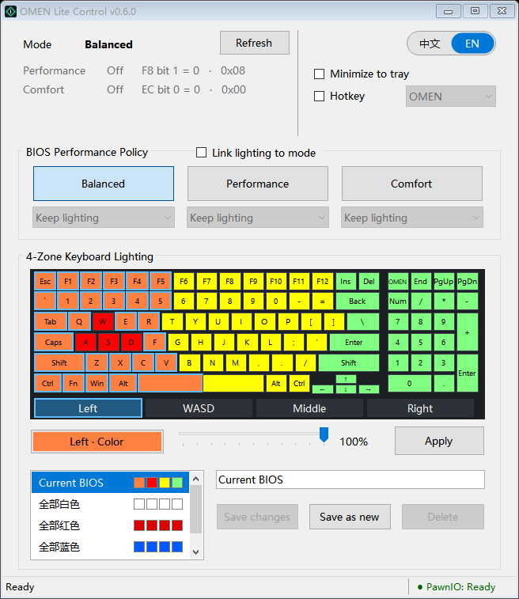

# OMEN-Lite-Control

[English](README.md) | [简体中文](README.zh-CN.md)

Performance and keyboard lighting controls for **HP OMEN 15 (2018), i7-8750H + GTX 1060, SSID 84DB / BIOS F.19**. Only tested on this configuration.

## Features

- Balanced, Performance and Comfort BIOS modes, with EC state readback
- Clickable four-zone keyboard with color and brightness controls
- Lighting presets with edit, rename, save-as and delete; current BIOS colors stay first
- Optional lighting preset links for each performance mode
- Cycle modes with the OMEN key or a custom hotkey
- Optional minimize to tray, with mode switching and exit in the tray menu
- Chinese / English language switch

## Usage

1. Download the ZIP from [Releases](https://github.com/JJl624/OMEN-Lite-Control/releases), extract all files, and run `OMEN-Lite-Control.exe` as administrator.
2. Click **Enable readback (install driver)** if prompted. The [PawnIO 2.2.0 installer](https://github.com/namazso/PawnIO.Setup/releases/tag/2.2.0) is included; an existing compatible driver is reused. Mode switching and keyboard lighting work without it.
3. Select a performance mode. For lighting, click a keyboard zone, double-click to choose a color, adjust brightness, then click **Apply**. Loading a preset does not apply it automatically.
4. Enable **Link lighting to mode** and choose presets. Linked lighting applies when startup, refresh or switching detects a mode change.
5. Enable **Hotkey**, then select OMEN or record a custom combination inline. Keep the app running; cycling requires PawnIO readback. Disable any existing key task that still launches Gaming Hub.
6. Enable **Minimize to tray** to hide the minimized window in the tray. Double-click its icon to restore; right-click to switch modes or exit. The default is minimizing to the taskbar.

The `driver` folder contains only the installer and can be deleted once compatible PawnIO is installed. Restore it only if you need to install or update the driver from the app. All settings are stored in `data/config.xml` beside the app; no user-profile settings are read or written. Click **Refresh** to reload the mode and keyboard colors; writes retain a 1-second interval; repeated hotkeys are ignored during switching.

[Release notes](https://github.com/JJl624/OMEN-Lite-Control/releases) · [License](LICENSE)

Built with Codex.
