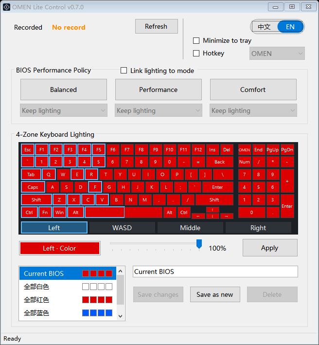

# OMEN-Lite-Control

[English](README.md) | [简体中文](README.zh-CN.md)

For **HP OMEN 15 (2018), i7-8750H + GTX 1060, SSID 84DB / BIOS F.19**. Only tested on this configuration.

> Versions before v0.7.0 may cause sleep or wake problems. Upgrade to v0.7.1.

## Features

- Balanced, Performance and Comfort BIOS modes, with the last successful request saved
- Four-zone keyboard colors, brightness and preset management
- Optional mode-linked lighting and OMEN/custom hotkeys
- Optional minimize to tray, with mode switching and exit
- Chinese / English

## Usage

1. Download from [Releases](https://github.com/JJl624/OMEN-Lite-Control/releases/latest), extract all files and run `OMEN-Lite-Control.exe` as administrator. No additional components need to be installed.
2. Select a mode to send a request. **The recorded mode is not hardware readback.** Restarting or other software may change the actual mode; select the recorded mode again to reapply it.
3. Hotkeys cycle the recorded mode, starting with Balanced if no record exists. Linked lighting applies only when explicitly requesting a mode, never automatically from an old record at startup or refresh.
4. Select a keyboard zone, double-click to choose a color, adjust brightness and click **Apply**. **Refresh** displays the record and reads keyboard colors through HP WMI.
5. Enable **Minimize to tray** to hide the minimized window. Double-click the tray icon to restore; right-click to switch modes or exit.

All settings and the mode record stay in `data/config.xml` beside the app. No user-profile storage is used. Mode requests are recorded only after BIOS accepts them.

[Releases](https://github.com/JJl624/OMEN-Lite-Control/releases) · [License](LICENSE)

Built with Codex.
