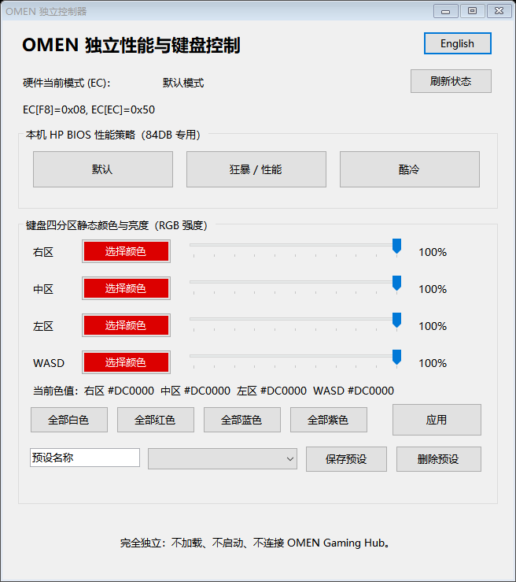

# OMEN-Lite-Control

[English](README.md) | [简体中文](README.zh-CN.md)

为 **暗影精灵 4（2018），i7-8750H + GTX 1060，主板 SSID 84DB / BIOS F.19** 制作的轻量控制工具，替代 OMEN Gaming Hub 的性能调节与键盘灯功能。

> 仅在上述配置上测试，不适用于其他机型。

## 功能

- 默认、狂暴 / 性能、酷冷三种 BIOS 模式
- 通过 EC 回读真实性能状态
- 四分区静态键盘颜色与亮度
- 最多 8 个键盘灯预设
- 中英文界面
- 不依赖 OMEN Gaming Hub、NVIDIA DLL 或 OmenMon

## 使用

1. 从 [Releases](https://github.com/JJl624/OMEN-Lite-Control/releases) 下载便携 ZIP，完整解压，以管理员身份运行 `OMEN-Lite-Control.exe`。
2. 如需回读性能状态，首次点击 **启用硬件读取（安装驱动）**。PawnIO 安装包已附带，无需另行下载；已有兼容驱动会直接复用。
3. 点击按钮切换性能模式。键盘选择颜色和亮度后点击 **应用**；加载预设不会自动写入。

## 注意

- 保留程序旁的 `ec`、`driver` 文件夹，设置保存在 `data` 中。
- 没有 PawnIO 仍可切换模式和控制键盘灯，但性能状态显示未知。
- 其他软件修改模式后，请点击 **刷新状态**。硬件操作有 1 秒间隔保护，语言切换与颜色编辑不受影响。

[更新内容](CHANGELOG.md)

## 许可

MIT，详见 [LICENSE](LICENSE) 与 [第三方声明](THIRD_PARTY_NOTICES.md)。
