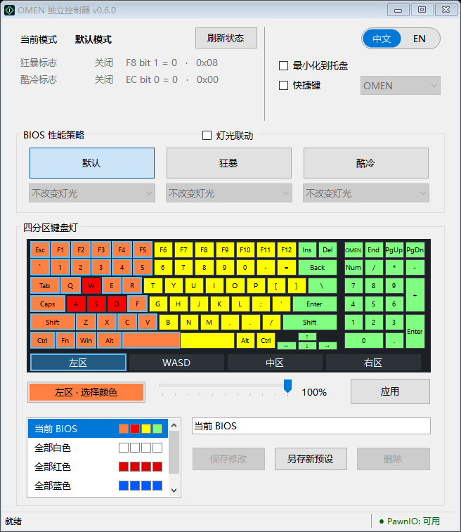

# OMEN-Lite-Control

[English](README.md) | [简体中文](README.zh-CN.md)

适用于 **暗影精灵 4（2018），i7-8750H + GTX 1060，SSID 84DB / BIOS F.19** 的性能与键盘灯控制工具。仅在此配置上测试。

## 功能

- 默认、狂暴、酷冷三种 BIOS 模式，支持 EC 状态回读
- 可点击的四分区键盘，支持颜色与亮度调节
- 灯光预设支持修改、改名、另存和删除，当前 BIOS 颜色固定置顶
- 各模式可关联灯光预设，联动可开关
- OMEN 键或自定义快捷键循环切换模式
- 可选最小化到托盘，托盘菜单切换模式或退出
- 中文 / EN 语言切换开关

## 使用

1. 从 [Releases](https://github.com/JJl624/OMEN-Lite-Control/releases) 下载 ZIP，完整解压，以管理员身份运行 `OMEN-Lite-Control.exe`。
2. 如有提示，点击 **启用硬件读取（安装驱动）**。已附带 [PawnIO 2.2.0 安装包](https://github.com/namazso/PawnIO.Setup/releases/tag/2.2.0)，已有兼容驱动会直接复用；不安装也可切换模式和控制键盘灯。
3. 点击按钮切换性能模式。点击键盘区域选区，双击选色，调整亮度后点击 **应用**；加载预设不会自动写入键盘。
4. 打开 **灯光联动**，为各模式选择预设；启动、刷新或切换检测到模式变化时应用。
5. 打开 **快捷键**，选择 OMEN 或在主界面录入自定义组合键。程序需保持运行，循环切换需要 PawnIO 回读；如仍有启动 Gaming Hub 的旧按键任务，请先停用。
6. 勾选 **最小化到托盘** 后，最小化时隐藏到托盘；双击托盘图标恢复，右键切换模式或退出。默认最小化到任务栏。

`driver` 文件夹仅存放安装包，安装兼容版本的 PawnIO 后即可删除；需要通过程序安装或更新驱动时再恢复。所有设置统一保存在程序目录的 `data/config.xml` 中，不读取或写入用户目录配置。点击 **刷新状态** 可重新读取模式和键盘颜色；写入指令保留 1 秒间隔保护，切换期间忽略重复快捷键。

[更新内容](https://github.com/JJl624/OMEN-Lite-Control/releases) · [许可](LICENSE)

本项目由 Codex 构建。
