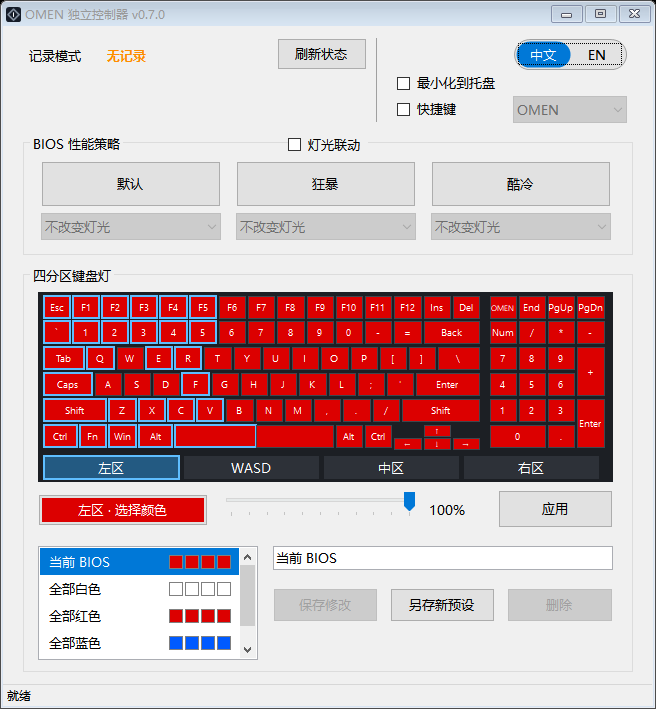

# OMEN-Lite-Control

[English](README.md) | [简体中文](README.zh-CN.md)

适用于 **暗影精灵 4（2018），i7-8750H + GTX 1060，SSID 84DB / BIOS F.19**。仅在此配置上测试。

> 旧版本可能导致睡眠或唤醒异常，建议升级至 v0.7.0。

## 功能

- 默认、狂暴、酷冷三种 BIOS 模式，保存最后成功请求的模式
- 四分区键盘颜色、亮度与预设管理
- 可选模式灯光联动、OMEN 键或自定义快捷键
- 可选最小化到托盘，支持切换模式和退出
- 中文 / English

## 使用

1. 从 [发行版](https://github.com/JJl624/OMEN-Lite-Control/releases/latest) 下载，完整解压，以管理员身份运行 `OMEN-Lite-Control.exe`。无需安装额外组件。
2. 点击模式按钮发送请求。**记录模式不是硬件回读**；重启或其他软件可能改变实际模式，可再次点击记录模式重新应用。
3. 快捷键按记录循环；没有记录时从默认模式开始。灯光联动仅在主动请求模式时应用，启动和刷新不会按旧记录写灯光。
4. 点击键盘区域选区，双击选色，调整亮度后点击 **应用**。**刷新状态** 重新显示记录并通过 HP WMI 读取键盘颜色。
5. 勾选 **最小化到托盘** 后，双击托盘图标恢复，右键切换模式或退出。

全部设置及模式记录保存在程序目录的 `data/config.xml`，不写入用户目录。模式记录只在 BIOS 接受请求后保存。

[发行版](https://github.com/JJl624/OMEN-Lite-Control/releases) · [许可](LICENSE)

本项目由 Codex 构建。
